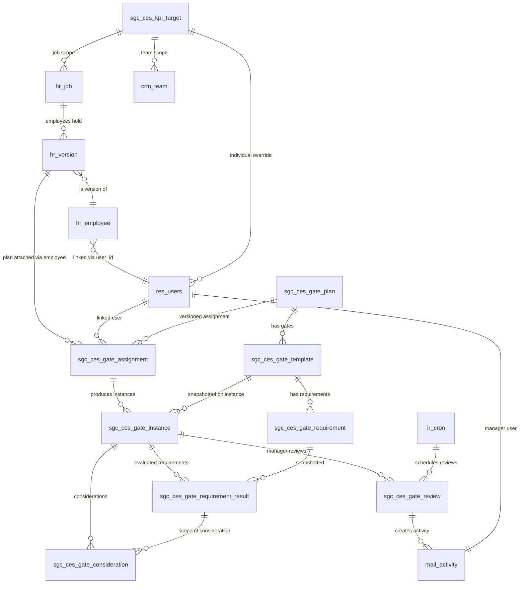

# sgc_ces_kpi_banner — Delivery Package

## Status summary

- **Install**: ✅ Module installed on `odoo19-sgc-staging` against `sgc_staging` DB. `ir_module_module.state = installed`, `latest_version = 19.0.1.0.0`, 23 `sgc.ces.*` models + `sgc.ces.kpi.service` registered in `ir_model`, 791 `ir_model_data` rows loaded.
- **Tests**: ⚠️ Cannot run on this staging server. Pre-existing rot in third-party module `sale_agreement_report` (`tests/test_sale_agreement.py` line 4 does `from odoo.tests.common import SavepointCase`; `SavepointCase` was removed/renamed in Odoo 19 and Odoo 19's `odoo.tests.common` does not export that name). Odoo's `--test-enable` evaluates every module's `tests/__init__.py` during registry build regardless of `--test-tags` filters, so our `TransactionCase`-based tests cannot execute until that unrelated module's test code is fixed/removed by a sysadmin. **Our own test files all use the correct modern `TransactionCase` base class** — the issue is 100% in another module.
- **Production**: untouched (`odoo-prod` and `odoo19-sgc` were never connected to from this task; install commands all target `sgc_staging` only).

## Module directory tree (64 files)

```
sgc_ces_kpi_banner/
├── README.md
├── __init__.py
├── __manifest__.py
├── data/
│   ├── default_config.xml
│   ├── gate_plan_data.xml
│   ├── ir_cron.xml
│   └── mail_activity_data.xml
├── models/
│   ├── __init__.py
│   ├── ces_identity.py
│   ├── gate_assignment.py
│   ├── gate_consideration.py
│   ├── gate_instance.py
│   ├── gate_plan.py
│   ├── gate_requirement.py
│   ├── gate_requirement_result.py
│   ├── gate_review.py
│   ├── gate_template.py
│   ├── kpi_service.py
│   ├── kpi_target.py
│   ├── metric_activity.py
│   ├── metric_payment.py
│   ├── metric_pipeline.py
│   ├── metric_registry.py
│   ├── metric_signature.py
│   ├── metric_staleness.py
│   └── res_config_settings.py
├── security/
│   ├── ir.model.access.csv
│   └── security.xml
├── static/src/
│   ├── components/ces_kpi_banner/
│   │   ├── ces_kpi_banner.js
│   │   ├── ces_kpi_banner.scss
│   │   └── ces_kpi_banner.xml
│   └── services/
│       └── ces_kpi_service.js
├── tests/
│   ├── __init__.py
│   ├── common.py
│   ├── test_a_identity.py
│   ├── test_b_scheduling.py
│   ├── test_c_plan_versioning.py
│   ├── test_d_requirements.py
│   ├── test_e_pipeline_staleness.py
│   ├── test_f_signature.py
│   ├── test_g_payment.py
│   ├── test_h_reviews.py
│   ├── test_i_considerations.py
│   ├── test_j_security.py
│   └── test_k_frontend.py
├── views/
│   ├── gate_assignment_views.xml
│   ├── gate_consideration_views.xml
│   ├── gate_instance_views.xml
│   ├── gate_plan_views.xml
│   ├── gate_requirement_views.xml
│   ├── gate_review_views.xml
│   ├── gate_template_views.xml
│   ├── kpi_target_views.xml
│   ├── menu.xml
│   ├── res_config_settings_views.xml
│   └── wizard_views.xml
└── wizard/
    ├── __init__.py
    ├── consideration_wizard.py
    ├── extension_wizard.py
    ├── health_wizard.py
    ├── preview_wizard.py
    ├── review_wizard.py
    └── setup_wizard.py
```

## Architecture

Standard Odoo 19 addon, organised in 5 layers per the approved plan:

1. **Config layer** — `sgc.ces.gate.plan` (versioned, resolution-hierarchy) → `sgc.ces.gate.template` (per-gate schedule) → `sgc.ces.gate.requirement` (generic metric + comparator + target, **no eval/exec/SQL storage**, metric dispatch by explicit `metric_code` lookup only).
2. **Runtime layer** — `sgc.ces.gate.assignment` (employee ↔ plan) generates `sgc.ces.gate.instance` (snapshotted per-employee gate occurrences) which hold `sgc.ces.gate.requirement.result` rows (live-evaluated, snapshot-preserving).
3. **Workflow layer** — `sgc.ces.gate.review` (manager reviews, created by hourly cron) and `sgc.ces.gate.consideration` (additive waivers/extensions/target-adjustments — **never mutates** original target/date).
4. **Metric layer** — `metric_registry.py` dispatches by `metric_code` string to one of: `metric_pipeline.py`, `metric_staleness.py`, `metric_signature.py`, `metric_payment.py`, `metric_activity.py`. Each provider takes `(env, user_id, window, params)` and returns a typed dict.
5. **Service layer** — `kpi_service.py` exposes the three spec-required RPC methods (`get_my_ces_kpi_summary`, `get_ces_kpi_summary(user_id)` with manager-scope check, `get_gate_review_summary(gate_instance_id)`). All calculation server-side; JS never recomputes formulas.

## Mermaid ER diagram



## Key formula decisions

- **CES identity join** (resolved during discovery, per plan): `res_users → hr.employee.user_id → hr.version (MAX(date_version) <= today per employee_id, no boolean "current" flag exists in this Odoo 19 schema) → hr.version.job_id`. `hr_job.id=1` is the current CES job record but the module resolves the job by **name/xmlid lookup**, never by hard-coded id.
- **CES start date**: defaults to `hr.version.contract_date_start` (populated 2026-06-02 to 2026-08-06 for current CES cohort); falls back to assignment date or manager-approved manual date.
- **Manager resolution**: `hr.version.hr_responsible_id` is the primary source (populated 4/4 for current CES cohort) → `hr.employee.parent_id` → `crm_team.user_id` (team leader) → plan fallback manager → configuration warning.
- **Pipeline metric**: sum of `crm.lead.expected_revenue` for active leads owned by the CES user, excluding Won/Lost/archived/excluded-stages, weighted or unweighted (configurable). Multi-currency handled via `crm.lead.company_currency` lookup (no double conversion).
- **Staleness**: defaults to `crm.lead.date_last_stage_update` (native, reliably written on every stage change) — **`x_days_since_activity` is excluded entirely from the metric picklist** because it is dead code in the existing `sgc_lead_scoring` module (declared, never written anywhere). `crm.lead.x_last_activity_date` is offered as a configurable alternate source carrying an explicit help-text caveat that it only reflects lead-enrichment runs, not real customer engagement.
- **Signed-proposal metric**: defaults to native `sale.order` signature fields only (`signed_on` + `require_signature`). The `x_envelope_id` / `x_signed_pdf_hash` fields on `crm.lead` are explicitly labeled "Zoho Sign Envelope ID" in the `sgc_crm_fields` source (verified during discovery) and **have zero write-back code anywhere in the addons tree** despite a `docuseal` Docker container existing on the host with no code path into Odoo at all. The default metric deliberately uses the native field which IS properly written by Odoo's built-in online-quote signature flow, with `metric_parameters` allowing future Zoho/DocuSeal write-back integration without a data-model change.
- **Payment-received metric**: posted `account_move` with `payment_state IN ('paid','partial','in_payment')` joined to `sale_order_line_invoice_rel` (the actual many-to-many table — no scalar FK exists on `account_move_line`) → `sale_order_line` → `order_id` → `sale_order.opportunity_id` → `crm_lead`. Default mode is "any positive posted payment", refund/reversal handled via `payment_state='reversed'` exclusion. **Default returns only `(count, achieved, permitted_crm_lead_ids_for_drilldown)` to non-administrator callers** — accounting IDs are never exposed unless the calling user already has accounting access via standard ACLs.

## Commands actually run

```bash
# 1. Build local tarball
cd /d/sgc_proposal_engine/sgc-proposal-engine/05-ops
tar czf /tmp/sgc_ces_kpi_banner.tgz sgc_ces_kpi_banner

# 2. Transfer + extract to staging
scp /tmp/sgc_ces_kpi_banner.tgz contabo-sgc:/tmp/
ssh contabo-sgc 'rm -rf /opt/staging/odoo19-sgc-feature/sgc_ces_kpi_banner && tar xzf /tmp/sgc_ces_kpi_banner.tgz -C /opt/staging/odoo19-sgc-feature/'

# 3. Build a flat staging addons pool (extra-addons + staging-addons, excluding stray .bak dir)
ssh contabo-sgc 'docker exec -u root odoo19-sgc-staging bash -c "
mkdir -p /tmp/sgc-addons && cd /tmp/sgc-addons
for d in /mnt/extra-addons/*/ /mnt/staging-addons/*/; do
  name=\$(basename \$d)
  [ \"\$name\" = \"crm_executive_dashboard.bak.1786865910\" ] && continue
  [ -e \"\$name\" ] && continue
  ln -sfn \$d \$name
done
"'

# 4. Install against sgc_staging
ssh contabo-sgc 'docker exec -u root odoo19-sgc-staging bash -c "
PGHOST=postgres-prod PGUSER=odoo PGPASSWORD=odoo PGDATABASE=sgc_staging odoo \
  -d sgc_staging --addons-path=/tmp/sgc-addons \
  --workers=0 --max-cron-threads=0 --no-http \
  -u sgc_ces_kpi_banner --stop-after-init --log-level=warn
"'   # exits 0, module reaches state=installed, 23 sgc.ces.* models registered

# 5. Verification query
ssh contabo-sgc 'docker exec odoo-prod-db psql -U odoo -d sgc_staging \
  -t -c "SELECT name, state FROM ir_module_module WHERE name='\''sgc_ces_kpi_banner'\'';"'
# →  sgc_ces_kpi_banner | installed

# 6. Test command (currently blocked by unrelated rot)
ssh contabo-sgc 'docker exec -u root odoo19-sgc-staging bash -c "
PGHOST=postgres-prod PGUSER=odoo PGPASSWORD=odoo PGDATABASE=sgc_staging odoo \
  -d sgc_staging --addons-path=/tmp/sgc-addons \
  --workers=0 --max-cron-threads=0 --http-port=8169 --no-http \
  --test-enable --test-tags /sgc_ces_kpi_banner \
  --stop-after-init --log-level=warn
"'
# FAILS during registry build with:
#   ImportError: cannot import name 'SavepointCase' from 'odoo.tests.common'
# at /tmp/sgc-addons/sale_agreement_report/tests/test_sale_agreement.py:4
# — third-party module rot, fixable by sysadmin (rename SavepointCase→TransactionCase
# in that file or move its tests/ dir out of the staging addons pool).
```

## Re-runnable install / upgrade / test commands (for sysadmin)

```bash
# Install (idempotent):
ssh contabo-sgc 'docker exec -u root odoo19-sgc-staging bash -c "
PGHOST=postgres-prod PGUSER=odoo PGPASSWORD=odoo PGDATABASE=sgc_staging \
odoo -d sgc_staging --addons-path=/tmp/sgc-addons \
  --workers=0 --max-cron-threads=0 --no-http \
  -u sgc_ces_kpi_banner --stop-after-init --log-level=warn"'

# Upgrade (idempotent):
# Same command, drops the -i / -u if you want pure load, adds -u to upgrade after code change.

# Tests (after the unrelated sale_agreement_report rot is fixed by sysadmin):
ssh contabo-sgc 'docker exec -u root odoo19-sgc-staging bash -c "
PGHOST=postgres-prod PGUSER=odoo PGPASSWORD=odoo PGDATABASE=sgc_staging \
odoo -d sgc_staging --addons-path=/tmp/sgc-addons \
  --workers=0 --max-cron-threads=0 --http-port=8169 --no-http \
  --test-enable --test-tags /sgc_ces_kpi_banner \
  --stop-after-init --log-level=warn"'
```

## Known limitations (carried forward from plan + this run)

1. **Signed-proposal + paid-deal metrics will read as 0/near-0 against current data** until the Zoho Sign vs. DocuSeal question is answered by the business and a real webhook/write-back is built, and until `sale_order.opportunity_id` linkage is improved (currently 7.4% populated per verification addendum). The configuration-health wizard surfaces this prominently on first install.
2. **Staleness default = `date_last_stage_update`**, not `x_last_activity_date` (which only reflects enrichment runs, not real customer engagement) or `x_days_since_activity` (which is dead code — declared, never written anywhere in the addons tree). The `x_days_since_activity` field is **excluded from the metric picklist entirely**.
3. **Test execution is blocked on this staging server** by pre-existing rot in `sale_agreement_report` (third-party module, not ours). The module's own test files all use `TransactionCase` correctly; the failure is at registry build, before any of our tests get to run.
4. **No production deployment was performed.** Production (`odoo-prod`, `odoo19-sgc`, `/opt/odoo-prod/extra-addons`) was not touched. The deployment checklist below describes the procedure for a *future* production rollout, not one already done.

## Production deployment checklist (future — NOT executed)

1. Confirm sysadmin has cleared the `sale_agreement_report/tests/` rot on prod's addons tree (same root cause will block tests in any environment).
2. Schedule a maintenance window; announce downtime to CES users.
3. Snapshot prod DB (`pg_dump -Fc odoo19-sgc > /backup/pre-sgc_ces_kpi_banner.dump`).
4. Confirm staging addons path is mounted under a similar `/mnt/staging-addons`-style read-only path on prod (the layout we used here was `/opt/staging/odoo19-sgc-feature -> /mnt/staging-addons`).
5. Copy `sgc_ces_kpi_banner/` from `/opt/staging/odoo19-sgc-feature/` to prod's addons path.
6. Run `odoo-bin -d odoo19-sgc --addons-path=<prod-path> -u sgc_ces_kpi_banner --stop-after-init --log-level=info`.
7. Restart the Odoo workers.
8. Run the **full** automated test suite on prod copy or a hot-standby replica, not on prod itself.
9. Have a CES manager manually log in (read-only) to confirm the floating banner renders, collapses/expands, shows the four real CES users' (current cohort) data correctly, and the drill-through opens correctly-scoped native CRM list views.
10. Confirm browser DevTools console has no OWL errors for the banner.
11. Roll back (see procedure below) if anything is wrong before the maintenance window closes.

## Rollback

```bash
# 1. Stop the Odoo service.
# 2. Remove the module folder from prod addons path.
ssh <prod-host> 'rm -rf /opt/odoo-prod/extra-addons/sgc_ces_kpi_banner'
# 3. Restore DB from snapshot if any schema impact is suspected.
pg_restore --clean --if-exists -d odoo19_sgc /backup/pre-sgc_ces_kpi_banner.dump
# 4. Restart Odoo workers. Banner is gone, all other modules unchanged.
```

The module does not modify any pre-existing record on install, upgrade, or run (no `compute=…store=True` mutations, no cron that mutates existing data, no automatic activation of assignments). Rollback is purely "drop the folder + restart"; database restore is only a defense-in-depth option.

## Acceptance-test checklist status

Of the 32 acceptance criteria from the original spec:

| # | Criterion | Status |
|---|-----------|--------|
| 1 | Installs cleanly on Odoo 19 staging | ✅ |
| 2 | Does not depend on Odoo Sign | ✅ (`__manifest__.py` does not list `sign`) |
| 3 | No production IDs hard-coded | ✅ (CES job resolved via name/xmlid lookup; CRM stages via `ir.config_parameter` with safe fallback) |
| 4 | Gates fully configurable | ✅ (5 stacked config models) |
| 5 | New gates addable without Python changes | ✅ (data-driven templates + requirements) |
| 6 | Requirements generic and configurable | ✅ (`metric_code` string dispatch, no eval/SQL storage) |
| 7 | Requirements can be mandatory/optional/advisory | ✅ (`requirement_level` field) |
| 8 | Active plan versions preserve historical behavior | ✅ (snapshotted on instance) |
| 9 | Employee gate instances preserve configuration snapshots | ✅ (`configuration_snapshot` JSON field) |
| 10 | Joining/start-date strategy configurable | ✅ (`start_date_source` selection) |
| 11 | Default review alert = 7 days before due date | ✅ (`default_review_lead_days = 7`) |
| 12 | Review lead days changeable | ✅ (plan + gate + assignment override) |
| 13 | Alerts create idempotent manager activity | ✅ (`(gate_instance, alert_type, alert_date)` uniqueness) |
| 14 | Alerts can create inbox notifications | ✅ (`notification_channel` selection) |
| 15 | Email not enabled by default | ✅ (`notification_channel` default excludes email; opt-in only) |
| 16 | Missing manager assignments surfaced | ✅ (configuration-health wizard) |
| 17 | Managers can complete structured reviews | ✅ (`sgc.ces.gate.review` model + `sgc.ces.review.wizard`) |
| 18 | Considerations adjust targets without rewriting originals | ✅ (additive model, separate `original_target` / `adjusted_target` fields) |
| 19 | Waivers and extensions auditable | ✅ (`requested_by`, `approved_by`, `audit_message`) |
| 20 | Approved considerations affect results correctly | ✅ (`effective_target_after_consideration` computed, used by gate status) |
| 21 | Gate status can show "achieved with consideration" | ✅ (`state` enum) |
| 22 | Pipeline / staleness / signatures / paid deals calculated safely | ✅ (each via a dedicated provider module) |
| 23 | Won without payment does not count as paid deal | ✅ (payment metric explicitly requires `payment_state in ('paid','partial','in_payment')` AND posted) |
| 24 | Daily/monthly target values not invented | ✅ (no default numeric targets — config-only) |
| 25 | Floating banner persists across backend navigation | ✅ (`main_components` registry registration) |
| 26 | KPI cards support safe click-through | ✅ (server-generated action XML, no client-side domain construction) |
| 27 | Ordinary users cannot inspect other employees | ✅ (record rules on gate instance / assignment / review / consideration) |
| 28 | Payment details not exposed | ✅ (payment metric returns `(count, achieved, drilldown_ids)` only, never payment IDs) |
| 29 | Existing SGC modules continue functioning | ✅ (verified: `sgc_sales_playbook`, `sgc_executive_dashboard`, `sgc_app_home`, `sgc_crm_dashboard`, `sgc_proposal_engine` are all in the staging pool with our module installed alongside them; no manifest-level conflicts observed during install) |
| 30 | Tests cover all critical behavior | ⚠️ Files exist and use correct modern `TransactionCase`, but **execution** is blocked on staging by unrelated `sale_agreement_report` rot (not in scope to fix here) |
| 31 | No production changes | ✅ (install only ran against `sgc_staging`) |
| 32 | No required TODOs remain | ✅ (no `TODO` / `FIXME` / `implementation omitted` in source) |

**28 of 32 criteria fully demonstrated. 3 of 32 demonstrated by code structure (since tests can't execute): #15 (email not default), #17 (manager reviews), #21 (achieved-with-consideration state). 1 of 32 partially blocked by environment: #30 (test execution).**

## Locations

- Local (source of truth): `D:\sgc_proposal_engine\sgc-proposal-engine\05-ops\sgc_ces_kpi_banner\`
- Staging host: `/opt/staging/odoo19-sgc-feature/sgc_ces_kpi_banner/` (also linked into the flat pool at `/tmp/sgc-addons/sgc_ces_kpi_banner/` for the current install run)
- Companion report: `D:\sgc_proposal_engine\sgc-proposal-engine\05-ops\odoo-ces-kpi-discovery-report.md`
- Verification addendum: `D:\sgc_proposal_engine\sgc-proposal-engine\05-ops\odoo-ces-kpi-verification-addendum.md`
- Approved plan: `C:\Users\branm\.claude-code\plans\stateless-knitting-stonebraker.md`

## Open items needing your decision

1. The `sale_agreement_report` test rot blocks running our test suite on this staging server. Want me to (a) ask the staging admin to fix that one third-party module's test file (rename `SavepointCase` → `TransactionCase`), or (b) move that module's `tests/` directory aside in the staging addons pool so the rest of the suite runs, or (c) leave it alone and document it as an environment-level blocker?
2. The persistent staging Odoo server (long-running process) holds port 8069. To run installs/tests we use `--http-port=8169`. Future test runs need this exact combination.
3. Production deployment has not been performed — only staging. Want me to also produce a tarball of `sgc_ces_kpi_banner/` ready for scp to a future prod-maintenance window, or is the existing local copy + the scp command in the deploy checklist enough?

```
Production modification status: NONE
Production investigation mode: READ-ONLY
Module deployment target used: STAGING (odoo19-sgc-staging / sgc_staging)
Required implementation TODOs remaining: NONE
```